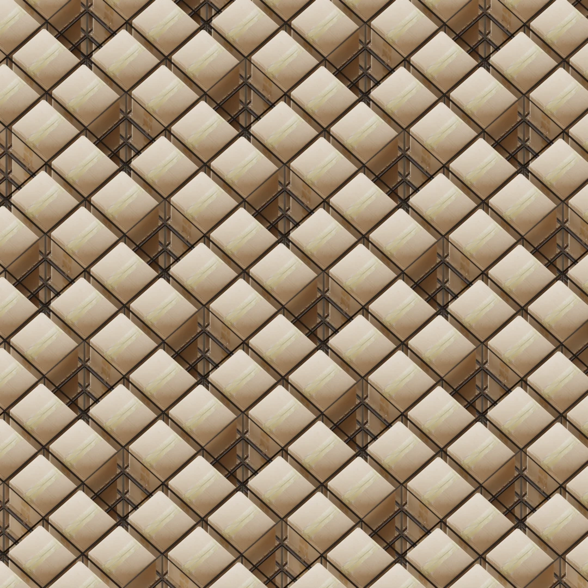
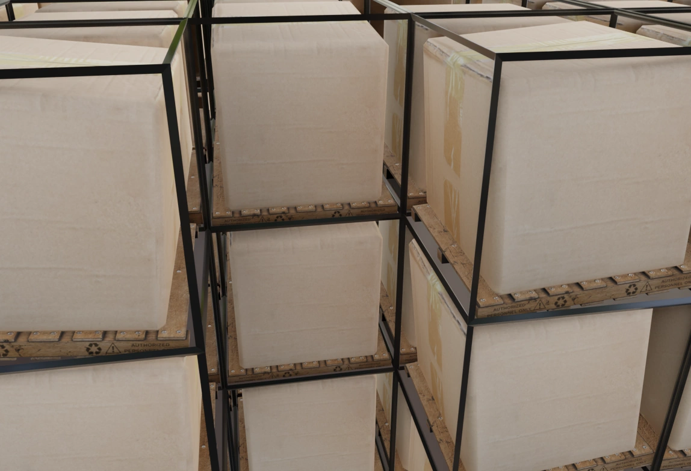
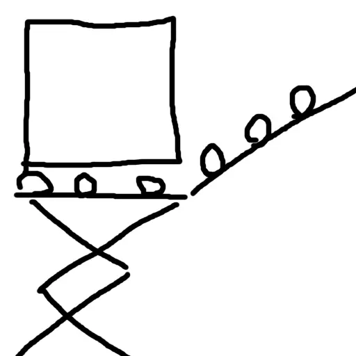
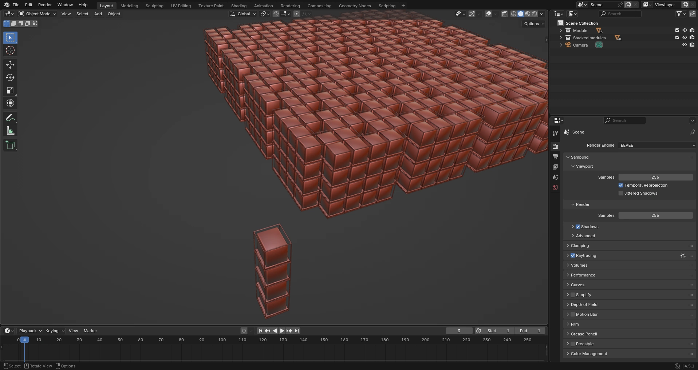

# robo-warehouse
## Idea for a robot-based architecture of a warehouse

[](https://github.com/ebolblga/robo-warehouse/blob/master/README.md)
[](https://github.com/ebolblga/robo-warehouse/blob/master/README.ru.md)
[![DeepWiki](https://img.shields.io/badge/DeepWiki-ebolblga%2Frobo--warehouse-blue.svg?logo=data:image/png;base64,iVBORw0KGgoAAAANSUhEUgAAACwAAAAyCAYAAAAnWDnqAAAAAXNSR0IArs4c6QAAA05JREFUaEPtmUtyEzEQhtWTQyQLHNak2AB7ZnyXZMEjXMGeK/AIi+QuHrMnbChYY7MIh8g01fJoopFb0uhhEqqcbWTp06/uv1saEDv4O3n3dV60RfP947Mm9/SQc0ICFQgzfc4CYZoTPAswgSJCCUJUnAAoRHOAUOcATwbmVLWdGoH//PB8mnKqScAhsD0kYP3j/Yt5LPQe2KvcXmGvRHcDnpxfL2zOYJ1mFwrryWTz0advv1Ut4CJgf5uhDuDj5eUcAUoahrdY/56ebRWeraTjMt/00Sh3UDtjgHtQNHwcRGOC98BJEAEymycmYcWwOprTgcB6VZ5JK5TAJ+fXGLBm3FDAmn6oPPjR4rKCAoJCal2eAiQp2x0vxTPB3ALO2CRkwmDy5WohzBDwSEFKRwPbknEggCPB/imwrycgxX2NzoMCHhPkDwqYMr9tRcP5qNrMZHkVnOjRMWwLCcr8ohBVb1OMjxLwGCvjTikrsBOiA6fNyCrm8V1rP93iVPpwaE+gO0SsWmPiXB+jikdf6SizrT5qKasx5j8ABbHpFTx+vFXp9EnYQmLx02h1QTTrl6eDqxLnGjporxl3NL3agEvXdT0WmEost648sQOYAeJS9Q7bfUVoMGnjo4AZdUMQku50McDcMWcBPvr0SzbTAFDfvJqwLzgxwATnCgnp4wDl6Aa+Ax283gghmj+vj7feE2KBBRMW3FzOpLOADl0Isb5587h/U4gGvkt5v60Z1VLG8BhYjbzRwyQZemwAd6cCR5/XFWLYZRIMpX39AR0tjaGGiGzLVyhse5C9RKC6ai42ppWPKiBagOvaYk8lO7DajerabOZP46Lby5wKjw1HCRx7p9sVMOWGzb/vA1hwiWc6jm3MvQDTogQkiqIhJV0nBQBTU+3okKCFDy9WwferkHjtxib7t3xIUQtHxnIwtx4mpg26/HfwVNVDb4oI9RHmx5WGelRVlrtiw43zboCLaxv46AZeB3IlTkwouebTr1y2NjSpHz68WNFjHvupy3q8TFn3Hos2IAk4Ju5dCo8B3wP7VPr/FGaKiG+T+v+TQqIrOqMTL1VdWV1DdmcbO8KXBz6esmYWYKPwDL5b5FA1a0hwapHiom0r/cKaoqr+27/XcrS5UwSMbQAAAABJRU5ErkJggg==)](https://deepwiki.com/ebolblga/robo-warehouse)

<p align="center">
  
</p>

## Problem Statement
In fully automated warehouses where only robots operate, the traditional architecture with rows of racks and aisles between them is not always optimal. Modern approaches to designing such warehouses strive to maximize storage density, minimize space for robots to move, and increase overall efficiency.

My proposal is this tiling that uses **~80%** of total space for storage:

<p align="center">
  
</p>

The key idea is that you need to access any pallet without moving others, meaning that every pallet needs at least one face exposed, so it can be taken out.

The above-shown grid tiling does exactly that; every pallet has one and exactly one air gap near it, and the air gap is exactly the size of the pallet so it can be extracted.

It is also worth noting that all pallets need to have a fixed size for this to work (not necessarily squares). Thankfully there is a widely adopted standard size of a pallet: *EPAL pallet* 1.2m x 0.8m

## Possible implementation
So we have the tiling; how would extraction and loading processes look like?

### Pallet extraction
Imagine a [scissor lift platform](https://en.wikipedia.org/wiki/Aerial_work_platform#:~:text=in%20their%20task.-,Scissor%20lift,-%5Bedit%5D) on a [roomba](https://en.wikipedia.org/wiki/Roomba) - this is the base of a robot that could operate on such storage. They have plenty of space under the shelves to move around with the pallets, and a simple A* algorithm with collision constraints should do the job for the logistics of moving around.

Pallets themselves should be on rollers and slightly angled towards the hole as shown below (you would need some small lock mechanism so they don't just slide down):

<p align="center">
  
</p>

Now taking a pallet out is as simple as lifting the platform in the needed hole and unlocking the needed pallet; it will roll down on the platform.

### Pallet loading
Loading operation is pretty similar to extraction. That scissor lift platform should have its own rollers on the top. Now you simply push the box into it's section and lock the mechanism to stop it from rolling back. No manipulator hands needed!

<p align="center">
  
</p>

## Renders
[Blender](https://www.blender.org/) has a built-in support for [scripting](https://docs.blender.org/api/current/info_quickstart.html) with Python. So I made a simple Python script [`src/main.py`](https://github.com/ebolblga/robo-warehouse/blob/master/src/main.py) thats takes specified collection and stacks it up according to the tiling pattern and given size.

Then made a low-polly low-effort module just for demonstration. Then I did some kitbashing with external assets:
- [Wooden pallet](https://skfb.ly/oUrRI) by *Mehdi Shahsavan* from Sketchfab (CC Attribution license)
- [Cardboard box](https://skfb.ly/o9SFu) by *PolyProps3D* from Sketchfab (CC Attribution license)
- [Empty workshop HDRI](https://polyhaven.com/a/empty_workshop) by *Sergej Majboroda* from Poly Haven (CC0 license)

After running the script, it will do the following:

<p align="center">
  
</p>

## Conclusion
I am not familiar with the problematics of warehouses and their logistics. But this seems like a viable option to me.

## Honorable mentions
Before working on this project I searched if it has been done before and here are some related concepts:
- [AutoStore](https://www.swisslog.com/en-us/products-systems-solutions/asrs-automated-storage-retrieval-systems/autostore-integrator) - bins stacked on top of each other in a grid, robots on top pick them out.
- [Ocado’s hive-grid system](https://www.ocadogroup.com/solutions/our-technology) - similar thing.

Those systems usually stack goods vertically and retrieve them from the top, meaning you can't just take out any pallet. Also their designs don't use full scale pallets.

## Developint [Python](https://www.python.org/downloads/) script
```bash
# Install the UV package manager
curl -LsSf https://astral.sh/uv/install.sh | sh
# powershell -ExecutionPolicy ByPass -c "irm https://astral.sh/uv/install.ps1 | iex" on Windows

# Clone the repository and navigate into it
git clone https://github.com/ebolblga/robo-warehouse.git
cd robo-warehouse

# Create virtual environment and install dependencies
uv sync

# Activate virtual environment
. .venv/bin/activate
# .venv\Scripts\activate on Windows

# Install pre-commit hooks
uv run pre-commit install

# Run pre-commit
uv run pre-commit run --all-files

# Ruff
uv run ruff format
uv run ruff check --fix
```

## [License](https://github.com/ebolblga/robo-warehouse/blob/master/LICENSE.md)
This program is licensed under the MIT License. Please read the License file to know about the usage terms and conditions.
