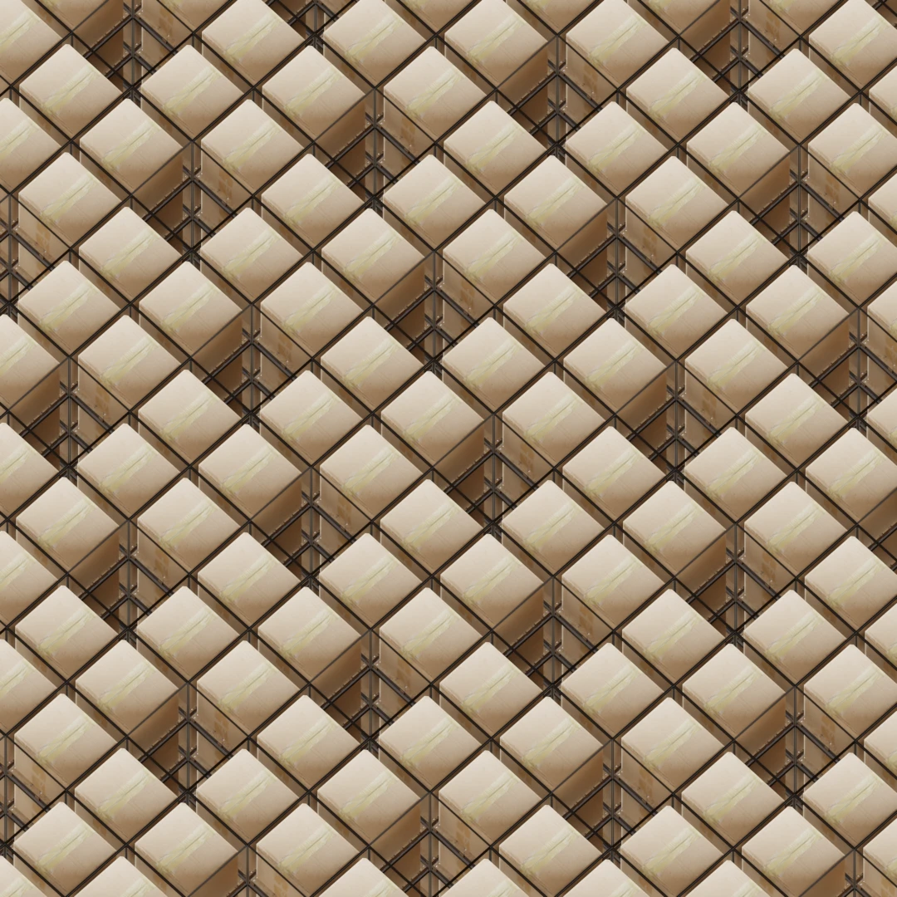
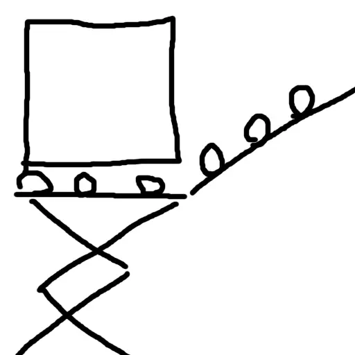

# robo-warehouse
## Идея роботизированной архитектуры склада

[](https://github.com/ebolblga/robo-warehouse/blob/master/README.md)
[](https://github.com/ebolblga/robo-warehouse/blob/master/README.ru.md)
[![DeepWiki](https://img.shields.io/badge/DeepWiki-ebolblga%2Frobo--warehouse-blue.svg?logo=data:image/png;base64,iVBORw0KGgoAAAANSUhEUgAAACwAAAAyCAYAAAAnWDnqAAAAAXNSR0IArs4c6QAAA05JREFUaEPtmUtyEzEQhtWTQyQLHNak2AB7ZnyXZMEjXMGeK/AIi+QuHrMnbChYY7MIh8g01fJoopFb0uhhEqqcbWTp06/uv1saEDv4O3n3dV60RfP947Mm9/SQc0ICFQgzfc4CYZoTPAswgSJCCUJUnAAoRHOAUOcATwbmVLWdGoH//PB8mnKqScAhsD0kYP3j/Yt5LPQe2KvcXmGvRHcDnpxfL2zOYJ1mFwrryWTz0advv1Ut4CJgf5uhDuDj5eUcAUoahrdY/56ebRWeraTjMt/00Sh3UDtjgHtQNHwcRGOC98BJEAEymycmYcWwOprTgcB6VZ5JK5TAJ+fXGLBm3FDAmn6oPPjR4rKCAoJCal2eAiQp2x0vxTPB3ALO2CRkwmDy5WohzBDwSEFKRwPbknEggCPB/imwrycgxX2NzoMCHhPkDwqYMr9tRcP5qNrMZHkVnOjRMWwLCcr8ohBVb1OMjxLwGCvjTikrsBOiA6fNyCrm8V1rP93iVPpwaE+gO0SsWmPiXB+jikdf6SizrT5qKasx5j8ABbHpFTx+vFXp9EnYQmLx02h1QTTrl6eDqxLnGjporxl3NL3agEvXdT0WmEost648sQOYAeJS9Q7bfUVoMGnjo4AZdUMQku50McDcMWcBPvr0SzbTAFDfvJqwLzgxwATnCgnp4wDl6Aa+Ax283gghmj+vj7feE2KBBRMW3FzOpLOADl0Isb5587h/U4gGvkt5v60Z1VLG8BhYjbzRwyQZemwAd6cCR5/XFWLYZRIMpX39AR0tjaGGiGzLVyhse5C9RKC6ai42ppWPKiBagOvaYk8lO7DajerabOZP46Lby5wKjw1HCRx7p9sVMOWGzb/vA1hwiWc6jm3MvQDTogQkiqIhJV0nBQBTU+3okKCFDy9WwferkHjtxib7t3xIUQtHxnIwtx4mpg26/HfwVNVDb4oI9RHmx5WGelRVlrtiw43zboCLaxv46AZeB3IlTkwouebTr1y2NjSpHz68WNFjHvupy3q8TFn3Hos2IAk4Ju5dCo8B3wP7VPr/FGaKiG+T+v+TQqIrOqMTL1VdWV1DdmcbO8KXBz6esmYWYKPwDL5b5FA1a0hwapHiom0r/cKaoqr+27/XcrS5UwSMbQAAAABJRU5ErkJggg==)](https://deepwiki.com/ebolblga/robo-warehouse)

<p align="center">
  
</p>

## Постановка задачи
В полностью автоматизированных складах, где работают только роботы, традиционная архитектура с рядами стеллажей и проходами между ними не всегда оптимальна. Современные подходы к проектированию таких складов стремятся максимально увеличить плотность хранения, минимизировать пространство для перемещения роботов и повысить общую эффективность.

Моё предложение - это покрытие квадратной сетки, которое использует **~80%** всего пространства под хранение:

<p align="center">
  
</p>

Ключевая идея заключается в том, что нужно иметь доступ к любому паллету, не перемещая другие. Это означает, что у каждого паллета должна быть хотя бы одна открытая сторона, чтобы его можно было извлечь.

Показанная выше сетка делает именно это: у каждого паллета есть ровно один выход рядом, и этот зазор точно равен размеру паллета, так что его можно вытащить.

Также стоит отметить, что все паллеты должны иметь фиксированный размер (необязательно квадратный). К счастью, существует широко принятый стандартный размер паллета: *EPAL-паллет* 1,2м × 0,8м.

## Возможная реализация
Хорошо, у нас есть разбиение. А как будут выглядеть процессы извлечения и загрузки?

### Извлечение паллета
Представьте себе [ножничный подъёмник](https://ru.wikipedia.org/wiki/%D0%9D%D0%BE%D0%B6%D0%BD%D0%B8%D1%87%D0%BD%D1%8B%D0%B9_%D0%BF%D0%BE%D0%B4%D1%8A%D1%91%D0%BC%D0%BD%D0%B8%D0%BA), установленный на [робот-пылесос](https://ru.wikipedia.org/wiki/Roomba) — это основа робота, который мог бы работать в таком хранилище. Под стеллажами достаточно места для перемещений с паллетами, а для логистики передвижений вполне хватит простого алгоритма A* с ограничениями по столкновениям.

Сами паллеты должны находиться на роликах и быть слегка наклонены к проёму, как показано ниже (при этом понадобится небольшой фиксатор, чтобы они не скатывались самопроизвольно):

<p align="center">
  
</p>

Теперь извлечь паллет так же просто, как поднять платформу в нужный проём и разблокировать паллет — он скатится вниз на платформу.

### Загрузка паллета
Операция загрузки очень похожа на извлечение. Таже подъёмная платформа должна иметь свои ролики сверху. Теперь вы просто задвигаете коробку в нужную секцию и фиксируете её, чтобы она не скатилась обратно. Никаких манипуляторов не требуется!

<p align="center">
  
</p>

## Рендеры
В [Blender](https://www.blender.org/) есть встроенная поддержка [скриптов](https://docs.blender.org/api/current/info_quickstart.html) на Python. Поэтому я сделал простой Python-скрипт [`src/main.py`](https://github.com/ebolblga/robo-warehouse/blob/master/src/main.py), который берёт указанную коллекцию и раскладывает её в соответствии с мещением и заданным размером.

Затем, на скорую руку, я сделал low-poly модель для демонстрации и использовал готовые ассеты:
- [Деревянный паллет](https://skfb.ly/oUrRI) от *Mehdi Shahsavan* (лицензия CC Attribution, Sketchfab)
- [Картонная коробка](https://skfb.ly/o9SFu) от *PolyProps3D* (лицензия CC Attribution, Sketchfab)
- [Пустая мастерская HDRI](https://polyhaven.com/a/empty_workshop) от *Sergej Majboroda* (лицензия CC0, Poly Haven)

После запуска скрипта результат будет таким:

<p align="center">
  
</p>

## Заключение
Я не знаком с проблематикой складов и их логистики, но мне кажется, что это вполне жизнеспособный вариант.

## Почётные упоминания
Прежде чем начать этот проект, я изучил, были ли подобные проекты реализованы ранее, и вот несколько похожих концепций:
- [AutoStore](https://www.swisslog.com/en-us/products-systems-solutions/asrs-automated-storage-retrieval-systems/autostore-integrator) — контейнеры, уложенные друг на друга в сетку, роботы сверху их вытаскивают.
- [Система ульев и сеток Ocado](https://www.ocadogroup.com/solutions/our-technology) — что-то похожее.

Эти системы обычно укладывают товары вертикально и извлекают их сверху, что означает, что вы не можете просто взять любую паллету. Кроме того, их конструкции не используют полноразмерные паллеты.

## Доработка [Python](https://www.python.org/downloads/) скрипта
```bash
# Установка менеджера пакетов UV
curl -LsSf https://astral.sh/uv/install.sh | sh
# powershell -ExecutionPolicy ByPass -c "irm https://astral.sh/uv/install.ps1 | iex" на Windows

# Склонируйте репозиторий и зайдите в него
git clone https://github.com/ebolblga/template.git
cd template

# Создание виртуальной среды и установка зависимостей
uv sync

# Активация виртуальной среды
. .venv/bin/activate
# .venv\Scripts\activate на Windows

# Установка pre-commit хуков
uv run pre-commit install

# Запуск pre-commit
uv run pre-commit run --all-files

# Ruff
uv run ruff format
uv run ruff check --fix
```

### Запуск скрипта в Blender
Сначала скачайте Blender (версия 4.5 использовалась для этого проекта). Теперь откройте файл [`assets/warehouse.blend`](https://github.com/ebolblga/robo-warehouse/blob/master/assets/warehouse.blend) и перейдите на вкладку «Скрипты». Если скрипт не открылся, откройте его и запустите.

## [Лицензия](https://github.com/ebolblga/robo-warehouse/blob/master/LICENSE.md)
Эта программа распространяется под лицензией MIT License. Пожалуйста, прочтите файл лицензии, чтобы узнать об условиях использования.
